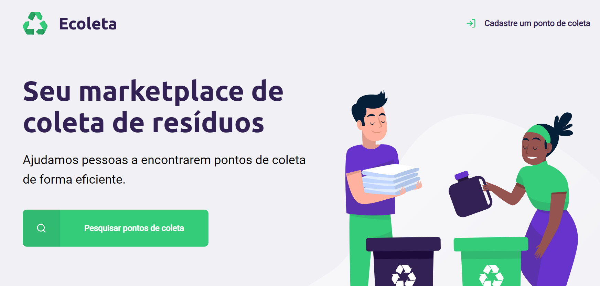

<h1 align="center">
  
</h1>

[Notas de aprendizado](.github/notes.md)

## O que é o Next Level Week?

> O NLW é uma semana prática com muito código, desafios, networking e um único objetivo: te levar para o próximo nível.
> [Next Level Week 1.0 - Rocketseat](https://nextlevelweek.com/)

## O Projeto: :recycle: ECOLETA

Um marketplace de coleta de resíduos.

O Ecoleta pode ser utilizado para consulta e cadastro de pontos de coleta de material reciclado.

  

## Tecnologias utilizadas

- JavaScript
- Nunjucks (Template Engine)
- Express
- NodeJS
- SQLite3
